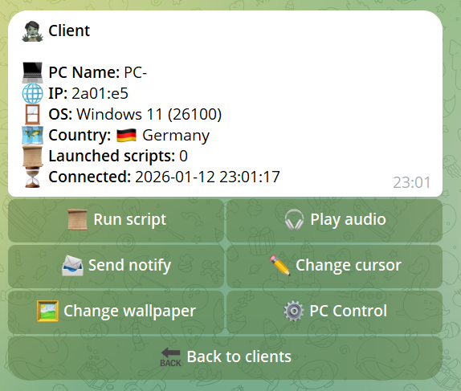

## 🚀 WinPrank - lightweight remote prank tool. Admin panel is telegram bot. Winprank contains 2 part(server & client). Using AES Encryption for data transfer.

## ⚠️ WARNING ⚠️
> **DISCLAIMER:** I (the author) am not responsible if you get fired, arrested, or punched.

> 1.  **DO NOT USE THIS ON STRANGERS.** Unauthorised access to computers is a crime.
> 2.  This tool is for **PRANKS ONLY** on people who explicitly trust you (for some reason).



## 🔥 Features

* **Change wallpaper**: Instantly replaces the user's desktop background with an image of your choice.
* **Change cursor**: Swaps the default system mouse cursor with a custom icon to confuse the user.
* **Play audio**: Remotely plays specific audio files or sound effects at high volume.
* **Create custom scripts**: Allows you to write, upload, and execute your own custom scripts for unique scenarios.
* **Keyboard button disco**: Rapidly toggles the Caps Lock, Num Lock, and Scroll Lock LED indicators to create a flashing light effect.
* **Trembling mouse**: Simulates cursor instability by randomly shaking the mouse pointer, making precise clicking difficult.
* **Send windows notify**: Displays a Windows system notification (toast) with a custom title and message.
* **Startup open app**: You can add to client startup app id and when user open exe file, app will be opened
* **Change Volume**: You can set 100% and 0% volume audio
* **Shutdown PC**: Shutdown friend`s pc

> ⚠️ WARNING ⚠️
>
> Some features may not work correctly or may require a system restart.

### ⚙️ Tested on Windows 11

## 💻 Installing
> ⚠️ WARNING ⚠️
> 
> If you want to replace AES encryption key(data_secure_key), then you need replace it in both configs

> Server 
> 1. Download winprank-server
> 2. Unpack to folder
> 3. Open @BotFather in telegram and create bot.
> 4. Open Config.toml and add you api token
> 5. Start Server
> 6. Open your telegram bot and write /myid
> 7. Open Config.toml and add your chat id
> 8. Its all!

> Client
> 1. Install Rust lang (```https://rust-lang.org/tools/install/```)
> 2. Download client winprank repo (```https://github.com/broke-off/winprank/tree/client#```)
> 3. You need buy your own VPS and install and open public address (`https://github.com/fatedier/frp` or `https://github.com/jpillora/chisel` or __NGROK__) 
> 4. Get your public address
> 5. Open winprank-client/src/config.rs and replace 0.0.0.0:3000 to your public address (without https://)
> 6. Open terminal and run ``cargo build --release``
> 7. Open winprank-client/target/release/ZeltaHepler.exe <- Its you prank exe file. When user open this file, you will be notified this
> 8. It's all!
> 
> Also, you can open winprank-client/Cargo.toml and replace name to your exe name

### ℹ️ In client part using myip.com for get ip & country of user

### Contact: https://t.me/dimitriy_nevelikiy 